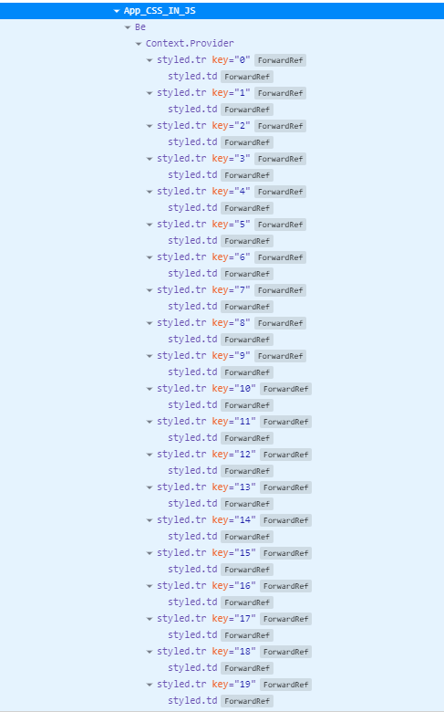
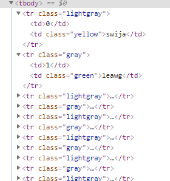
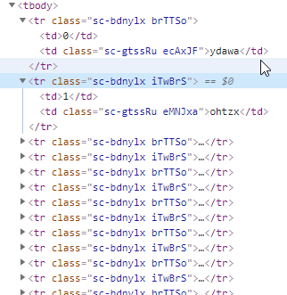
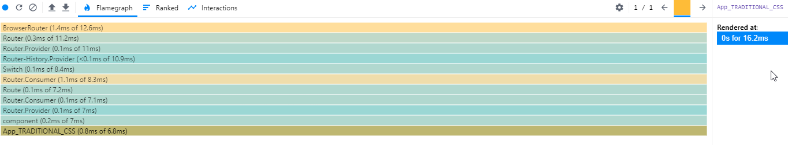
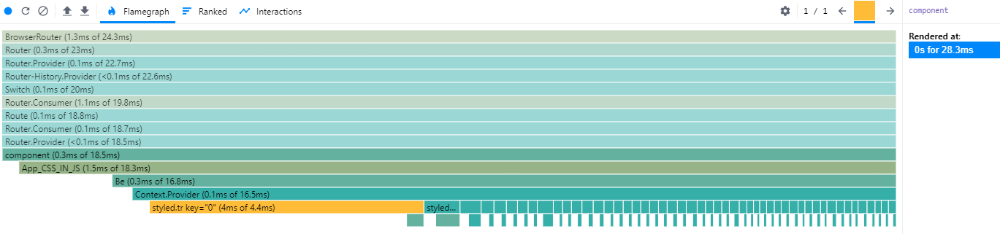

# Benchmark Traditional CSS VS CSS-IN-JS

|  | Traditional CSS | CSS-IN-JS |
|--| --------------- | --------- |
|Components Tree| | 
|Dom Tree 2| | 
|Flamegraph| |
|Render Times with tables of 50 rows (10 iterations, results in miliseconds)|21.3, 12.9, 18.1, 16.1, 20.5, 12.9, 14, 17.1, 16.1, 15.4|30.2,30.7 ,31.6 ,29.1 ,43.1 ,29.4 ,23.5 ,31.1 ,22.3 ,28.3
| AVG Render times (in miliseconds)|16.44|29.93|
| SUM Render Times (in miliseconds)|164.4|299.3
